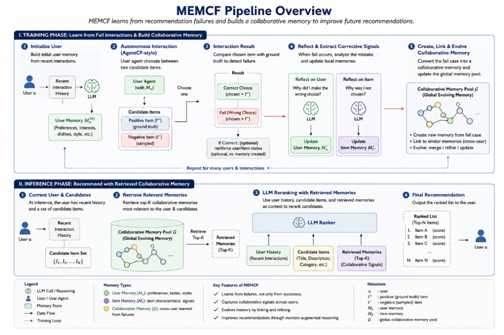
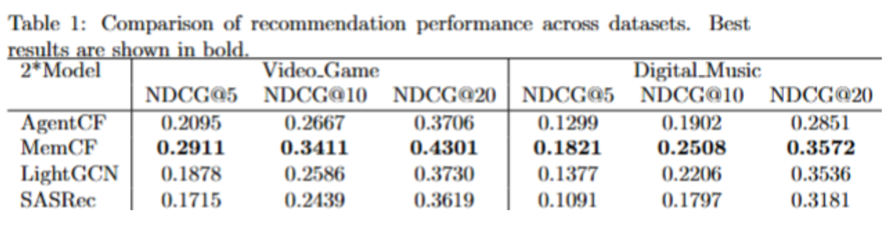

# MEMCF: Memory-Enhanced Collaborative Failure Learning for Recommendation

MEMCF is a memory-augmented recommendation framework that learns compact failure lessons from pairwise recommendation mistakes and reuses those lessons during LLM-based candidate reranking.

The core idea is simple: if a recommender repeatedly chooses the wrong item for a user, the failure itself contains useful preference evidence. MEMCF converts these mistakes into short, graph-indexed memory facts, then retrieves only relevant facts at evaluation time.

<p align="center">
  
</p>

## Abstract

Large language models can rank recommendation candidates from user histories and item metadata, but their decisions are unstable when user histories are short, item descriptions are noisy, or many candidates are semantically close. MEMCF addresses this by introducing a collaborative failure memory layer. During training, it asks an LLM to choose between a ground-truth positive item and a sampled negative item. When the LLM chooses incorrectly, MEMCF records the failure context and distills it into a compact memory lesson. At evaluation, MEMCF retrieves lessons through a user-item memory graph and injects only short factual preference hints into the ranking prompt.

MEMCF is designed to test whether failure-derived memories improve recommendation beyond a no-memory LLM reranker under the same candidates, same user histories, and same local OpenAI-compatible model endpoint.

## Contributions

MEMCF makes four implementation-level contributions:

1. Failure-centered supervision: memory is created only from pairwise mistakes where the model selects a negative item over the observed positive item.
2. Compact memory facts: each failure is stored as a structured event, but evaluation receives only short preference facts instead of raw long-form reasoning.
3. Graph-scoped retrieval: memory facts are retrieved through user, history-item, candidate-item, and neighboring-user paths rather than unrestricted global similarity.
4. Auditable traces: every major LLM call, parsed output, retrieval decision, and ranking result is saved as JSONL for manual inspection.

## Method Overview

MEMCF has two phases.

### Phase 1: Failure-Memory Construction

1. Initialize user memory from recent user history.
2. Build pairwise training tasks from each user's positive interactions and sampled negative candidates.
3. Ask the LLM to choose one item from each pair.
4. If the LLM chooses the negative item, store a failure event containing:
   - user id
   - user history item ids
   - correct item
   - wrong item
   - candidate pair metadata
   - model choice
5. Distill the failure event into a compact graph memory fact, for example:
   - `User with preference for lightweight skincare often prefers moisturizing cleanser over decorative accessories.`
6. Add the fact to a user-item memory graph.

### Phase 2: Memory-Guided Evaluation

1. Load the same user history and the same candidate set used by the no-memory baseline.
2. Retrieve graph-scoped memory facts through:
   - the same user
   - candidate items
   - history items
   - nearby users connected by shared items
3. Insert only short memory facts into the ranking prompt.
4. Ask the LLM to rank all candidates.
5. Save ranking outputs, metrics, and JSONL traces for inspection.

The memory passed to the LLM is intentionally short and factual. MEMCF avoids passing long free-form failure analysis into evaluation because noisy explanations can hurt ranking.

## Repository Layout

```text
MEMCF/
├── README.md                         # Paper-style overview and usage guide
├── pyproject.toml                    # Python package metadata and CLI entrypoint
├── requirements.txt                  # Minimal runtime dependencies
├── run.py                            # Root-level executable entrypoint
├── configs/
│   └── env.example                   # Environment variables for local model/data paths
├── src/memcf/
│   ├── __init__.py                   # Package metadata
│   ├── __main__.py                   # Enables `python -m memcf`
│   └── experiment.py                 # Reference implementation of MEMCF training/evaluation
├── scripts/
│   ├── run_smoke.sh                  # 5-user smoke test
│   ├── run_ablation_one_dataset.sh   # Run one dataset and one ablation variant
│   └── run_16_ablation_jobs.sh       # Launch 4 datasets x 4 variants in parallel
├── docs/
│   ├── DATA_FORMAT.md                # Expected runtime data format
│   ├── TRACE_FORMAT.md               # Trace files and how to inspect them
│   └── ABLATIONS.md                  # Recommended ablation protocol
├── assets/
│   ├── pipeline.png                  # Pipeline figure
│   └── results.png                   # Result figure or experimental snapshot
├── data/                             # Runtime datasets, ignored except README
├── agent_memory/                     # Saved memory pools, ignored except README
└── evaluation_results/               # Rankings, summaries, traces, ignored except README
```

## Implementation Map

The reference implementation is intentionally kept in one file so that experiment behavior is easy to audit.

| Symbol | Role |
| --- | --- |
| `TraceRecorder` | Writes per-event JSONL traces and a chronological `events.jsonl`. |
| `MEMCFUserState` | Stores compact user-level memory initialized from history. |
| `MEMCFItemState` | Stores compact item-level state for pairwise training. |
| `RecommendationMemorySystem` | Owns LLM calls, memory creation, tracing, and diagnostics. |
| `MemoryGraphIndex` | Maintains graph links between users, items, and failure lessons. |
| `initialize_user_memory_from_history_v2` | Builds initial user memory from history before failure training. |
| `train_memory_graph_from_fail_interactions_v2` | Runs pairwise failure training and creates graph memory lessons. |
| `evaluate_user_v2` | Retrieves graph memory facts and ranks candidates. |
| `parse_args_v2` | Defines the MEMCF command-line interface. |
| `main_v2` | End-to-end experiment entrypoint. |

## Installation

Use Python 3.10+.

```bash
cd MEMCF
python3 -m venv .venv
source .venv/bin/activate
pip install -r requirements.txt
pip install -e .
```

MEMCF calls an OpenAI-compatible chat endpoint through HTTP. For local inference, start your model server first, then configure the endpoint:

```bash
export chat_api_base=http://127.0.0.1:8000/v1
export api_base=http://127.0.0.1:8000/v1
export chat_model_name=gpt-3.5-turbo-16k-0613
export embedding_model_name=/path/to/local/embedding_model
```

`chat_model_name` can be any model name accepted by your local API server.

## Data Format

Each dataset must live under `$MEMCF_DATA_ROOT/<dataset_name>/` and contain:

```text
items.json
user_sequences_10.json
user_negatives_10.json
```

Example:

```bash
export MEMCF_DATA_ROOT=/home/ubuntu/24nam.nh/video_games_data/runtime_data
export MEMCF_EVAL_ROOT=/home/ubuntu/24nam.nh/video_games_data/evaluation_results_memcf
export MEMCF_MEMORY_ROOT=/home/ubuntu/24nam.nh/video_games_data/agent_memory_memcf
```

See [docs/DATA_FORMAT.md](docs/DATA_FORMAT.md) for exact schemas.

## Quick Smoke Test

```bash
cd MEMCF
source .venv/bin/activate
cp configs/env.example .env.local
source .env.local

bash scripts/run_smoke.sh All_Beauty_1000u
```

This runs 5 users with memory enabled and writes outputs to `$MEMCF_EVAL_ROOT` and `$MEMCF_MEMORY_ROOT`.

## Main CLI

Run the no-memory LLM reranker:

```bash
python -m memcf \
  --data_name Video_Game \
  --number_of_users 100 \
  --no_use_memory \
  --max_positive_interactions 5 \
  --max_negative_candidates 19
```

Run MEMCF with graph memory:

```bash
python -m memcf \
  --data_name Video_Game \
  --number_of_users 100 \
  --use_memory \
  --max_iterations 1 \
  --max_positive_interactions 5 \
  --max_negative_candidates 19 \
  --graph_memory_k 3 \
  --neighbor_k 10 \
  --min_evidence_terms 1
```

Run MEMCF with no-harm arbitration:

```bash
python -m memcf \
  --data_name Video_Game \
  --number_of_users 100 \
  --use_memory \
  --max_iterations 1 \
  --max_positive_interactions 5 \
  --max_negative_candidates 19 \
  --graph_memory_k 3 \
  --neighbor_k 10 \
  --min_evidence_terms 1 \
  --no_harm_arbitration
```

## Recommended Ablations

MEMCF should be evaluated against its own no-memory baseline under the same user set and candidate set.

| Variant | Description |
| --- | --- |
| `A0_no_memory` | LLM reranking from user history and candidate item metadata only. |
| `A1_safe_graph_no_noharm` | MEMCF graph memory facts, no arbitration. |
| `A2_safe_graph_noharm` | MEMCF graph memory facts with no-harm arbitration. |
| `A3_safe_graph_k5_noharm` | Same as A2, but retrieves up to 5 memory facts. |

Run one dataset and one variant:

```bash
bash scripts/run_ablation_one_dataset.sh Video_Game A2_safe_graph_noharm
```

Launch all 16 jobs for 4 datasets x 4 variants:

```bash
bash scripts/run_16_ablation_jobs.sh
```

The script writes PIDs to `$MEMCF_EVAL_ROOT/_pids/`.

## Traces

By default, MEMCF writes JSONL traces for every run. These traces are important for research debugging because they show exactly how memories were created and used.

Important trace files:

| File | Purpose |
| --- | --- |
| `user_memory_initialized.jsonl` | Initial user memory derived from history. |
| `autonomous_choice_result.jsonl` | Pairwise training choice and whether it failed. |
| `failure_event_created.jsonl` | Structured failure event. |
| `failure_lesson_created.jsonl` | Compact memory lesson created from a failure. |
| `global_memory_added.jsonl` | Lesson inserted into global memory graph. |
| `graph_memory_retrieval.jsonl` | Retrieved memory facts for each evaluation user. |
| `memory_facts_selected.jsonl` | Final short facts injected into the prompt. |
| `ranking_llm.jsonl` | Full ranking prompt and LLM response. |
| `ranking_result.jsonl` | Parsed ranking and metrics per user. |
| `no_harm_arbitration.jsonl` | Arbitration decision when enabled. |

See [docs/TRACE_FORMAT.md](docs/TRACE_FORMAT.md) for inspection commands.

## Experimental Snapshot

The figure below can be replaced with the latest full-run result figure.

<p align="center">
  
</p>

When reporting MEMCF results, always include:

- number of evaluated users
- candidate count per user
- top-k metrics: Recall@5/10/20 and NDCG@5/10/20
- whether memory was enabled
- graph memory parameters: `graph_memory_k`, `neighbor_k`, `min_evidence_terms`
- whether no-harm arbitration was enabled
- local model name and endpoint
- trace directory for auditability

## Reproducibility Notes

LLM reranking is sensitive to model server settings, prompt formatting, token limits, parsing errors, and concurrency. For fair comparison:

- use the same candidate set for all variants
- use the same user subset for all variants
- use temperature `0.0` when supported by the endpoint
- save raw ranking JSON and JSONL traces
- compare no-memory and memory variants on the same data split
- report parsing failures and skipped users

## Citation

If you use this repository in a paper, cite it as the MEMCF implementation associated with your project. A formal BibTeX entry can be added after the project is public.
